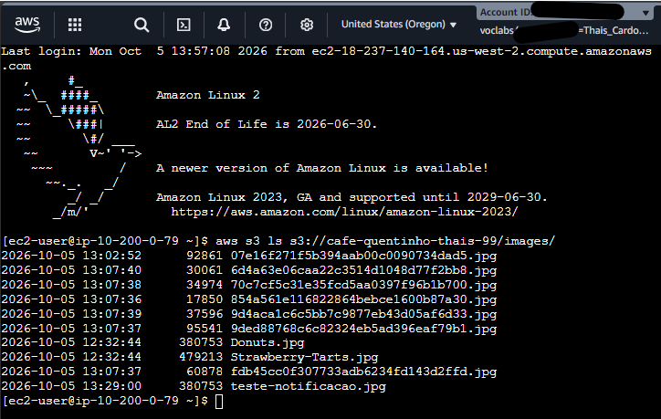
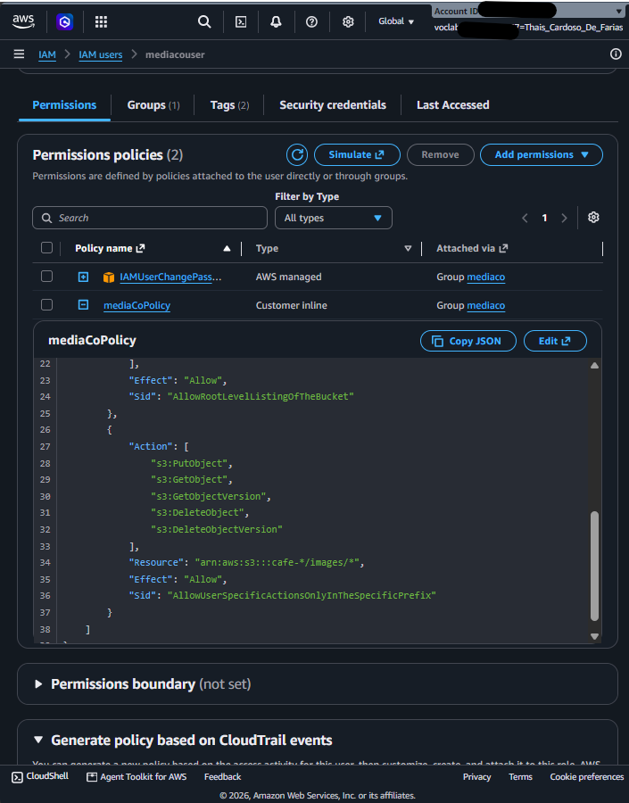
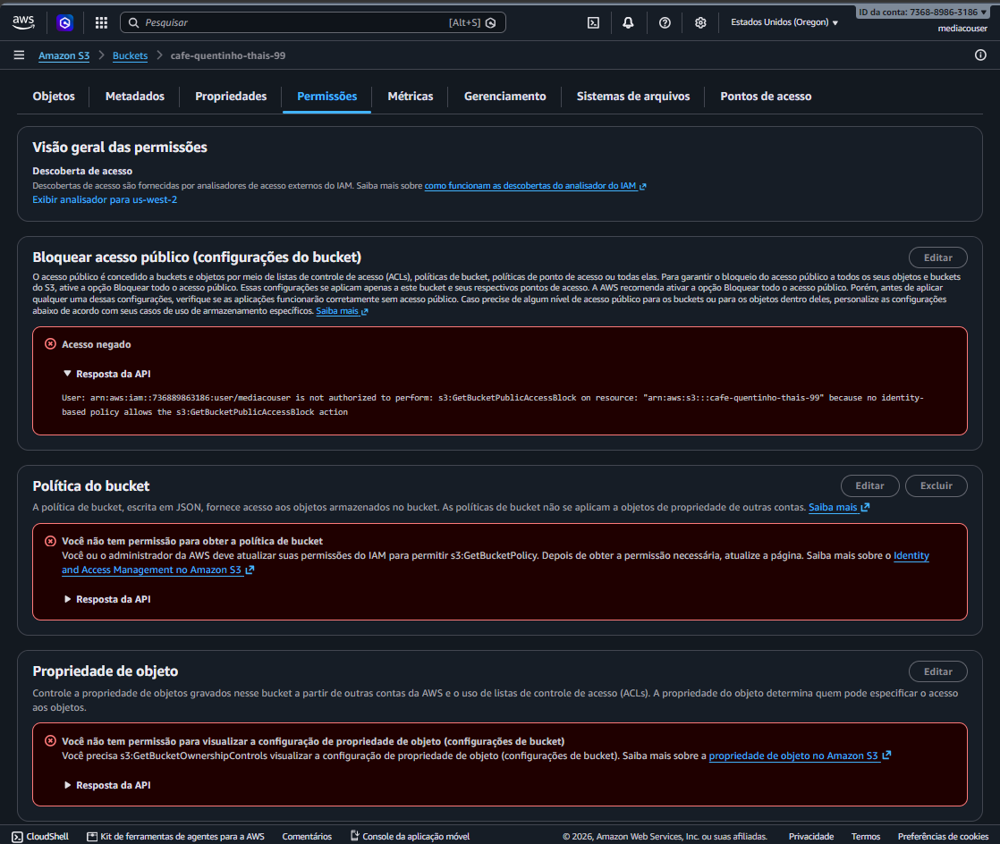
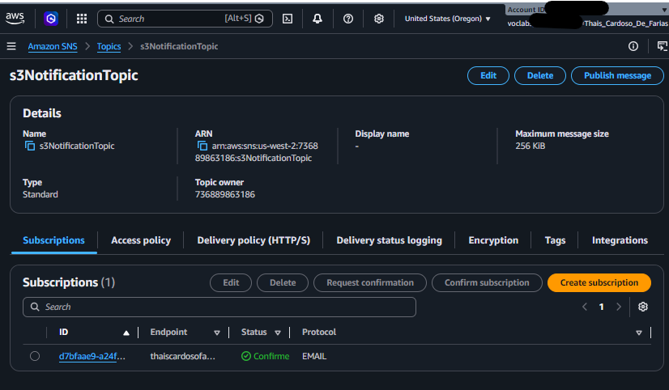
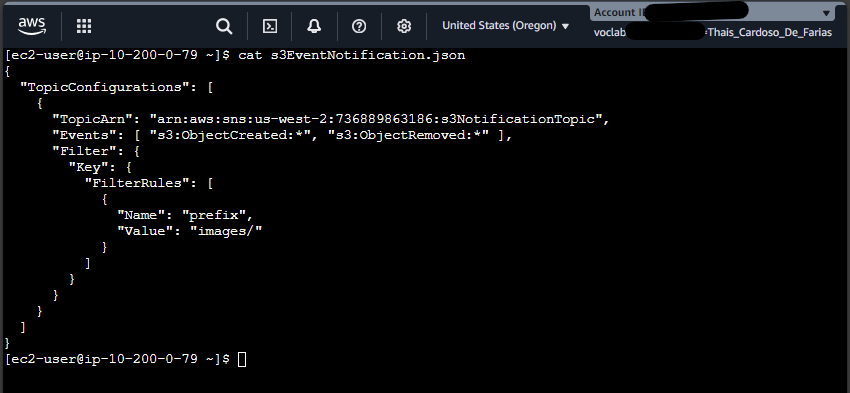
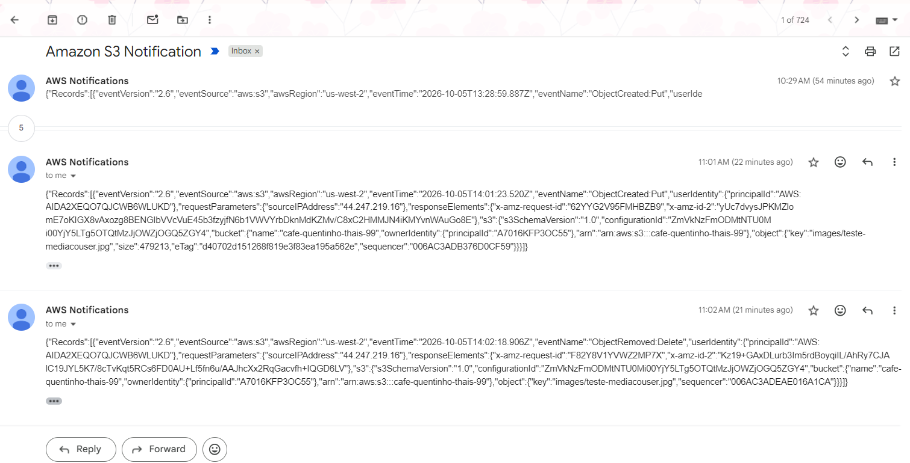

# AWS S3: Compartilhamento Seguro de Arquivos com IAM e Notificações Automatizadas via Amazon SNS


## 📌 Visão Geral do Projeto

Este projeto demonstra a implementação de uma solução segura de armazenamento e auditoria de arquivos utilizando **Amazon S3**, **AWS IAM** e **Amazon SNS**. 

A arquitetura foi desenhada para simular o cenário de uma empresa que precisa compartilhar um bucket com um fornecedor/usuário externo (`mediacouser`) para gestão de ativos de mídia, mantendo controle estrito de acessos com o princípio do menor privilégio e monitoramento em tempo real de alterações no bucket por e-mail.

---

## 🏗️ Arquitetura da Solução

```text
[ AWS CLI / Console ]
         │
         ▼
  ┌──────────────┐      Upload/Delete      ┌─────────────────────────┐
  │ mediacouser  │ ──────────────────────► │  Amazon S3 Bucket       │
  └──────────────┘                         │  (cafe-quentinho-...)   │
                                           └────────────┬────────────┘
                                                        │
                                                        │ Event Trigger
                                                        ▼
                                           ┌─────────────────────────┐
                                           │   Amazon SNS Topic      │
                                           │ (s3NotificationTopic)   │
                                           └────────────┬────────────┘
                                                        │
                                                        │ E-mail Alert
                                                        ▼
                                           ┌─────────────────────────┐
                                           │    Admin Subscriber     │
                                           └─────────────────────────┘
```

## 🚀 Tecnologias e Serviços Utilizados

- **Amazon S3:** Armazenamento de objetos, estruturação de pastas (`/images`) e motor de publicação de eventos.
- **AWS IAM (Identity and Access Management):** Criação de grupos, políticas granulares (`mediaCoPolicy`) e restrição de permissões administrativas.
- **Amazon SNS (Simple Notification Service):** Tópico pub/sub para envio automatizado de e-mails sobre criações e deleções de objetos.
- **AWS CLI (s3 & s3api):** Gerenciamento programático e provisionamento de configurações JSON diretamente via terminal.
- **Amazon EC2:** Servidor auxiliar de gerenciamento e testes de permissão via perfis CLI.

---

## ⚙️ Etapas de Implementação e Evidências Práticas

### 1. Provisionamento do Bucket S3 e Sincronização Inicial
Foi realizado o criação do bucket regional `cafe-quentinho-thais-99` via AWS CLI e efetuada a carga inicial do conjunto de arquivos de mídia para a pasta lógica `images/` utilizando o comando `aws s3 sync`.

**Evidência 01 — Sincronização de arquivos via AWS CLI:**


---

### 2. Governança de Acessos com IAM e Validação do Menor Privilégio
Configuração do usuário `mediacouser` e do grupo `mediaco` com permissões restritas apenas ao diretório `images/`. 

Para testar o princípio do menor privilégio, efetuamos o login no console com as credenciais do `mediacouser`. O usuário conseguiu visualizar os arquivos na pasta liberada, porém foi bloqueado com a mensagem de *"Insufficient permissions"* ao tentar acessar as configurações de segurança do bucket.

**Evidência 02 — Estrutura de permissões do grupo IAM:**


**Evidência 03 — Teste de acesso negado no console S3 (Princípio do Menor Privilégio):**


---

### 3. Configuração do Tópico SNS e Inscrição de Alertas
Criação do tópico **Amazon SNS** de tipo *Standard* (`s3NotificationTopic`) e configuração da assinatura via e-mail. Ajustamos a **Access Policy** do tópico para autorizar expressamente a entidade `s3.amazonaws.com` a publicar mensagens geradas pelo bucket.

**Evidência 04 — Tópico SNS com inscrição de e-mail confirmada:**


---

### 4. Automatização de Notificações de Eventos via AWS CLI (`s3api`)
Elaboração do arquivo de definição de eventos `s3EventNotification.json` para capturar ações de criação (`s3:ObjectCreated:*`) e remoção (`s3:ObjectRemoved:*`) no prefixo `images/`. A regra foi aplicada no S3 utilizando o utilitário `aws s3api put-bucket-notification-configuration`.

**Evidência 05 — Criação do JSON e vinculação da notificação via s3api:**


---

### 5. Validação do Fluxo de Auditoria em Tempo Real
Simulação do ciclo de vida de objetos realizando operações de `upload` e `delete` de imagens no terminal através do perfil `mediacouser`. O S3 interceptou as ações e disparou automaticamente os alertas JSON diretamente para a caixa de entrada do administrador.

**Evidência 06 — E-mail de notificação recebido via Amazon SNS com payload JSON:**


---

## 🛡️ Práticas de Segurança e Aprendizados Integrados

- **Isolamento por Prefixo (Folder-level security):** Acesso restrito estritamente ao diretório `/images`, impedindo leitura/escrita em qualquer outra área do bucket.
- **Controle de Acesso Negativo Ativo:** Garantia de que usuários operacionais externos não consigam alterar políticas de bucket ou configurações de segurança.
- **Auditoria Passiva por Eventos:** Notificação em tempo real de adições e remoções de arquivos sem necessidade de varredura manual de logs.

---

## ✒️ Autoria

Projeto desenvolvido por **Thais Cardoso de Farias** como parte do treinamento prático de arquitetura e governança em nuvem AWS.
